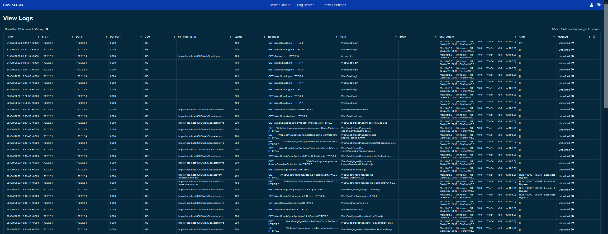
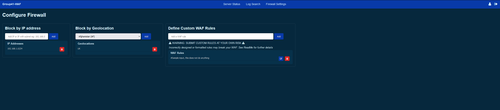

<!-- Improved compatibility of back to top link: See: https://github.com/othneildrew/Best-README-Template/pull/73 -->
<a name="readme-top"></a>
<!-- PROJECT SHIELDS -->
<!--
*** I'm using markdown "reference style" links for readability.
*** Reference links are enclosed in brackets [ ] instead of parentheses ( ).
*** See the bottom of this document for the declaration of the reference variables
*** for contributors-url, forks-url, etc. This is an optional, concise syntax you may use.
*** https://www.markdownguide.org/basic-syntax/#reference-style-links
-->

<!-- PROJECT LOGO -->
<br />
<div align="center">
  <a href="https://github.com/capstone-g41-waf-ids/">
    
  </a>

<h3 align="center">Web Application Firewall</h3>

  <p align="center">
    Swinburne 2022 Capstone Group 41 Project
    <br />
    <br />

  </p>
</div>


<!-- TABLE OF CONTENTS -->
<details>
  <summary>Table of Contents</summary>
  <ol>  
    <li>
      <a href="#about-the-project">About The Project</a>
      <ul>
        <li><a href="#built-with">Built With</a></li>
      </ul>
    </li>
    <li>
      <a href="#getting-started">Getting Started</a>
      <ul>
        <li><a href="#prerequisites">Prerequisites</a></li>
        <li><a href="#installation">Installation</a></li>
      </ul>
    </li>
    <li><a href="#usage">Usage</a></li>
    <li><a href="#roadmap">Roadmap</a></li>
    <li><a href="#acknowledgments">Acknowledgments</a></li>
  </ol>
</details>


<!-- ABOUT THE PROJECT -->
## About The Project

This project is developed as part of the Swinburne 2022 Software Engineering Capstone. Group 41 have produced a containerised Web Application Firewall to meet the requirements of the client. This application is placed between the clients web applications and the end user. It intercepts traffic and detects malicious injections intended to compromise the clients web applications and redirects normal interactions to the correct endpoint.

<p align="right">(<a href="#readme-top">back to top</a>)</p>


### Built With

* [![Docker][Docker.com]][Docker-url]
* [![Nginx][Nginx.com]][Nginx-url]
* [![MongoDB][MongoDB.com]][MongoDB-url]
* [![Python][Python.org]][Python-url]
* [![Flask][Flask]][Flask-url]


<p align="right">(<a href="#readme-top">back to top</a>)</p>


<!-- GETTING STARTED -->
## Getting Started (Test Environment)

The following instructions allow you to get a local copy of this project and get it up and running on your machine, please follow all steps to ensure the project functions correctly.
<br>
<br>
These install instructions produce a testing environment with <a href=https://github.com/WebGoat/WebGoat>WebGoat</a>, a deliberately **insecure** web application, as a demonstration of the WAFs capabilities. Further instructions will be provided below for configuration in a custom environment.
<br>
<br>
These instructions are based for usage on a Linux machine, however if the prerequisites are met, then the project can be run on Windows.

### Prerequisites

Please install the following items before attempting to install / run the project.
* Install Docker
  ```sh
  Follow instructions provided by Docker: https://docs.docker.com/get-docker/
  ```

### Installation

1. Clone the repo
   ```sh
   git clone https://github.com/capstone-g41-waf-ids/waf.git
   ```
2. Run docker-compose file
   ```sh
   docker compose build infrastructure/docker-compose.yml
   ```
3. Verify that the following containers are running:
    * web-application-firewall
    * database
    * webgoat
4. Verify that the portals are accessible by attempting to reach the following URLs:
    * The WAF Configuration Portal
      ```sh
       https://<localhost>:30
      ```
    * The WebGoat Application (Accessed through the WAF)
      ```sh
       https://<localhost>:8000
      ```
<p align="right">(<a href="#readme-top">back to top</a>)</p>


<!-- USAGE EXAMPLES -->
## WAF Configuration Portal Usage

Please note that the design in these screenshots and the actual product may differ, however the functionality remains the same.
<br>
<br>
### The Login Page

<br>

To login to the application use the following credentials:
<br>
**Please Change the password for use in a live or internet exposed environment**
```sh
username: admin
password: 12345
```

After logging in a session is generated with your credentials. You are then redirected to the logs page.

### The Logs Page
This page shows the communications between the client and the web applications sitting behind the WAF. 
<br>



It provides the following information: IP Address
### The Server Status Page


### The Settings Page


### The Edit User Page


<p align="right">(<a href="#readme-top">back to top</a>)</p>


<!-- ROADMAP -->
## Roadmap

- [ ] Blocking Spoofing, Capture Replay and Alternate Channels
- [ ] Additional Users / Forgot Password Functionality
- [ ] Develop an IDS to work with the WAF
    - [ ] Nested Feature


<p align="right">(<a href="#readme-top">back to top</a>)</p>

<!-- ACKNOWLEDGMENTS -->
## Acknowledgments

* [Roy](https://github.com/orgs/capstone-g41-waf-ids/people/RoystonJoel)
* [Ellen](https://github.com/orgs/capstone-g41-waf-ids/people/orangeblossomest)
* [Tom](https://github.com/orgs/capstone-g41-waf-ids/people/Choski)
* [Darcy](https://github.com/orgs/capstone-g41-waf-ids/people/ASD-Database)

<p align="right">(<a href="#readme-top">back to top</a>)</p>


<!-- MARKDOWN LINKS & IMAGES -->
<!-- https://www.markdownguide.org/basic-syntax/#reference-style-links -->
[product-screenshot]: images/screenshot.png
[Docker.com]: https://img.shields.io/badge/docker-%230db7ed.svg?style=for-the-badge&logo=docker&logoColor=white
[Docker-url]: https://docker.com/
[Nginx.com]: https://img.shields.io/badge/nginx-%23009639.svg?style=for-the-badge&logo=nginx&logoColor=white
[Nginx-url]: https://nginx.com/
[MongoDB.com]: https://img.shields.io/badge/MongoDB-%234ea94b.svg?style=for-the-badge&logo=mongodb&logoColor=white
[MongoDB-url]: https://mongodb.com/
[Python.org]: https://img.shields.io/badge/python-3670A0?style=for-the-badge&logo=python&logoColor=ffdd54
[Python-url]: https://python.org/
[Flask]: https://img.shields.io/badge/flask-%23000.svg?style=for-the-badge&logo=flask&logoColor=white
[Flask-url]: https://flask.palletsprojects.com/
